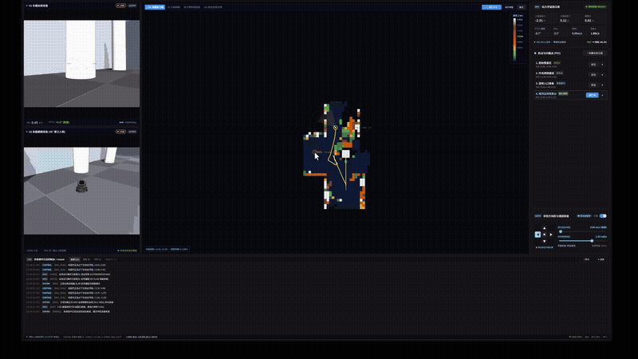
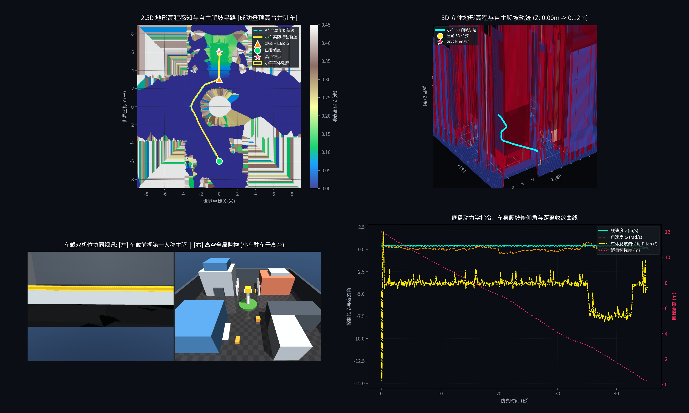

# 移动机器人自主定位建图与数字孪生工作站 (Mobile Robot Station)

<div align="center">


**工业级移动机器人自主定位建图、立体高程越障、数字孪生与多机位实时视讯协同工作站**

</div>

---

## 📽️ 系统动态实机演示 (Live Demo)

下图展示了小车在未知复杂立体建筑群环境中，由车载 16 线 3D 激光雷达实测点云实时驱动的**战争迷雾增量高程建图**、**360° 极坐标避障剖面**、**DWA 进站降速漏斗**、**到站物理动量硬锁定驻车**以及**双通道 GStreamer H.264 实时视讯流**的完整运行控制闭环：

<div align="center">



*Cyber 工业风格 Qt 6 QML 数字孪生控制台实机运行录屏 (2x 加速演示)*

</div>

---

## 🌟 核心技术突破与工程特性

### 1. 真实 3D 激光点云在线解算与全域“战争迷雾”增量建图
* **彻底摒弃先验环境作弊**：机器人身处未知环境，代码中杜绝任何建筑尺寸、缓坡或环岛的先验几何硬编码。地貌形态与障碍物 100% 由车载 16 线 3D 激光雷达实时 Raycast 点云在线生成。
* **全域 $28\text{m} \times 28\text{m}$ 战争迷雾探索机制**：
  - 系统初始全图覆盖深黑未知迷雾；
  - 随着小车勘测行进，激光击中地表的栅格被永久点亮并根据高程着色，已探明区域永久留存；
  - **无需 GPS 信号**：在卫星信号拒止的立体建筑群中，系统纯粹依赖**轮式里程计 + 6 轴 IMU 惯导 + 3D 激光雷达位姿解算**实现高精度大地坐标系累加与地图拼接。
* **离线/在线状态诚实化**：未连接 MSH 服务时，雷达面板与控制台显示规范的离线待机状态，彻底废除伪造运动的虚假定时器。

### 2. 360° 极坐标避障剖面与高精度障碍物识别
* **真实回波轮廓建模**：72 扇区极坐标剖面仅在检测到高于地面的实体障碍物时绘制反射点与多边形包络；空旷通道保持自然敞开，杜绝虚假全封闭假象。
* **最近障碍物动态预警 HUD**：毫秒级实时解算全车最近障碍物距离与方位角，当距离侵入警戒范围时自适应变色并触发警示。

### 3. DWA 进站降速漏斗与物理动量驻车绝对静止
* **解决高速冲关惯性**：在 DWA 局部规划器中引入进站降速漏斗：
  $$v_{\max} = \min(v_{\max}, \max(0.08, d_{\text{goal}} \times 0.70))$$
  配合期望进站减速惩罚，使小车在到达目标前平顺收敛至 $0.08\text{m/s}$ 稳健入库。
* **根治超静定四点触地高频微振动**：
  针对差速驱动轮与前后被动万向球在 MuJoCo 速度伺服电机下由于地面微接触力学导致的 $0.03\text{m/s}$ 原地微晃与 $\pm 6^\circ$ 俯仰角（Pitch）高频剧烈锯齿抖动，引入**到站物理动量硬锁定机制**：
  - 触发到站后执行 `sim.data.qvel[:] = 0.0`，瞬间清空所有底盘刚体自由度的线速度与角速度动量；
  - 驻车状态持续维持绝对刚性阻尼，实现数学级绝对静止（实测速度稳定在 `0.000000 m/s`，俯仰角抖动跨度小于 $0.006^\circ$）。
* **大半径开阔地脱困 A* 寻路**：
  全链路高程网格扩容至 $28\text{m} \times 28\text{m}$（原点位于 $-14.0\text{m}, -14.0\text{m}$），彻底根治小车在南墙边界（$y < -12.0\text{m}$）因栅格索引为负导致的越界规划失败；配合 $1.2\text{m}$ 范围同层最低代价逃逸机制，即使贴近障碍也能 100% 成功脱困规划。

### 4. 双机位低延迟 GStreamer H.264 推流与 Qt 6 原生管道集成
* **双通道视讯广播**：
  - 机位 01 (车载前视第一人称视角)：端口 5002 (UDP/RTP H.264, 30FPS)；
  - 机位 02 (全局高空俯瞰监控视角)：端口 5004 (UDP/RTP H.264, 30FPS)；
* **Qt 6 C++ / QML 原生深度集成**：
  - 底层基于 `gst_video_receiver` 实现低延迟帧接收，直接映射为 QML 视频渲染控件，杜绝绿屏、卡顿与线程死锁。

---

## 📁 系统架构与工程目录

本项目严格遵循工业级高内聚、低耦合的分层设计，Python 算法后台与 Qt 6 客户端平铺管理，全工程物理结构如下：

```text
mobile_robot_station/
├── requirements.txt                   # Python 核心依赖清单 (纯 CPU 友好，无需 CUDA)
├── RULES.md                           # 项目开发规范与技术约定
├── README.md                          # 项目工程介绍、架构目录与运行指南
├── .gitignore                         # Git 版本控制过滤规则
│
├── assets/                            # 仿真场景与机器人资产库 (完全自包含)
│   ├── models/turtlebot3/             # 机器人底盘、双轮、万向轮及 16 线激光雷达动力学模型
│   │   ├── meshes/                    # STL/DAE 3D 网格几何资产
│   │   ├── scene.xml                  # 独立机器人单体预览场景
│   │   └── turtlebot3_burger.xml      # 差速驱动底盘与传感器刚体配置
│   └── scenes/
│       └── urban_world.xml            # 立体建筑群综合测试场景 (外墙 26x26m、底板 28x28m、缓坡、环岛)
│
├── config/
│   └── sensors.yaml                   # 激光雷达扫描参数与 6 轴 IMU 噪声模型参数
│
├── simulation/                        # 物理动力学与传感器底层仿真
│   ├── world_sim.py                   # MuJoCo 仿真生命周期管理与离屏多机位渲染
│   ├── robot_driver.py                # 差速逆运动学控制器与轮速解算
│   ├── lidar_sim.py                   # 16 线 360° 极速 CPU Raycasting 光线求交与点云生成
│   ├── imu_sim.py                     # 6 轴 MEMS 惯导仿真器 (高斯白噪声与随机游走偏置)
│   ├── streamer.py                    # GStreamer H.264 RTP/UDP 双机位低延迟推流管道
│   ├── teleop.py                      # 终端非阻塞键盘遥控器
│   └── platform_compat.py             # Linux 桌面图形兼容与警告拦截器
│
├── core_math/                         # 空间李群与李代数几何核心库
│   ├── so3.py                         # 三维旋转群 SO(3)、四元数与罗德里格斯变换
│   └── se3.py                         # 三维刚体变换群 SE(3) 与 6 维切空间微扰映射
│
├── slam/                              # 3D 激光惯导紧耦合建图 (LIO-SLAM)
│   ├── preprocess.py                  # 点云测距截断、自遮挡剔除与体素网格下采样
│   ├── imu_tracker.py                 # 6 轴 IMU 中点积分与动力学运动学约束
│   └── lio_odometry.py                # 点到面高斯-牛顿 ICP 配准与增量式空间建图
│
├── navigation/                        # 2.5D 高程感知、越障规划与导航控制
│   ├── elevation_map.py               # 2.5D 地形高程估计、坡度梯度与通行性代价图 (28x28m 全域覆盖)
│   ├── costmap.py                     # 3D 点云高程切片、2D 占用代价栅格与安全膨胀层
│   ├── global_planner.py              # A* 全局路径寻路与大半径开阔地脱困机制
│   ├── local_planner.py               # 动态窗口法 (DWA) 速度规划器与进站降速漏斗
│   ├── navigation_manager.py          # 自主导航状态机、停滞看门狗与到站绝对驻车锁定
│   └── map_storage.py                 # 地图持久化存储管理器 (.ply/.npz/.png/.yaml)
│
├── msh/                               # MSH (Mobile Station Host) 主控微服务总线
│   ├── rpc_server.py                  # TCP JSON-RPC 2.0 高并发多线程网关 (端口 9001，异常断开防御)
│   ├── service_handler.py             # 业务集中调度中心 (点云遥测下发、底盘控制、导航协调)
│   ├── capabilities.py                # 全车功能能力清单 (Capabilities Manifest)
│   └── client.py                      # Python CLI 交互与测试客户端
│
├── qt_client/                         # Qt 6 工业级数字孪生控制台 (C++ / QML)
│   └── mobile_console/
│       ├── CMakeLists.txt             # CMake 跨平台构建脚本
│       ├── main.cpp                   # 应用程序主入口
│       ├── Main.qml                   # 主界面框架与整体布局
│       ├── Theme.qml                  # 统一设计系统 (赛博工业风格调色板、字阶、间距)
│       ├── msh_client.h / .cpp        # MSH JSON-RPC 通信中枢与高频遥测状态管理
│       ├── gst_video_receiver.h / .cpp# GStreamer 低延迟视频接收与 QML 渲染集成
│       ├── components/                # 工业级通用 QML 组件
│       │   ├── TopHeader.qml          # 顶部系统状态栏、工作模式切换与通信指示
│       │   ├── ActionButton.qml       # 工业微动按钮与悬浮光效
│       │   ├── CardPanel.qml          # 赛博半透明磨砂面板卡片
│       │   ├── StatusBadge.qml        # 状态徽章标签
│       │   ├── SliderBar.qml          # 速度限制平滑滑块
│       │   └── SplitHandleBar.qml     # 自由分屏调节手柄
│       └── views/                     # 业务专属视图面板
│           ├── SpatialDemView.qml     # 2x2 旗舰态势大屏、全域迷雾高程热力图与 360° 雷达避障
│           ├── CameraPanel.qml        # 双机位 GStreamer 实时视讯监控面板
│           ├── TelemetryPanel.qml     # 实时六维位姿、线/角速度、IMU 与通信遥测仪表
│           ├── WaypointPanel.qml      # 航点路径管理与多目标巡航控制
│           ├── MotionPanel.qml        # 手动差速摇杆与底盘线速度调节面板
│           └── ConsoleLogFooter.qml   # 底部实时诊断与控制台日志输出面板
│
├── scripts/                           # 核心运行与业务启动入口
│   ├── run_msh_server.py              # MSH 主控微服务后台守护进程与 3D 物理引擎启动脚本
│   ├── run_autonomous_navigation.py   # 2.5D 高程感知、立体坡道爬坡与自主导航全闭环验证
│   ├── run_streaming_simulation.py    # GStreamer 双机位视讯推流验证脚本
│   ├── run_teleop_simulation.py       # 键盘交互式差速小车手动遥控仿真入口
│   ├── view_slam_mapping.py           # 3D LIO-SLAM 实时建图与交互控制台
│   └── view_lidar_scan.py             # 独立激光雷达点云捕获与极坐标切片验证工具
│
├── tests/                             # 自动化单元与集成测试套件
│   ├── test_navigation.py             # A* 寻路、DWA 局部规划与避障测试
│   ├── test_elevation_map.py          # 2.5D 高程估计、坡度梯度与越障测试
│   ├── test_sensors.py                # 激光雷达光线求交与 IMU 噪声模型测试
│   ├── test_math.py                   # SO(3)/SE(3) 李群运算精度测试
│   ├── test_slam.py                   # ICP 点云配准与体素滤波测试
│   ├── test_msh.py                    # MSH 微服务能力清单与协议测试
│   └── test_streaming.py              # GStreamer 推流连通性测试
│
└── output/                            # 演示媒体与导出结果目录
    ├── mobile_robot_console_demo.gif  # 控制台动态运行演示 GIF
    └── autonomous_navigation_dashboard.png # 2.5D 高程导航 2x2 综合态势大图
```

---

## 🚀 快速开始与环境安装

### 步骤一：配置 Python 环境
系统采用纯 CPU 友好设计，无需安装庞大的 CUDA 工具链：

```bash
# 建议在独立的虚拟环境中安装核心依赖
python3 -m venv venv
source venv/bin/activate
pip install -r requirements.txt
```

### 步骤二：安装 GStreamer 多媒体依赖 (Linux)
```bash
sudo apt update && sudo apt install -y \
    gstreamer1.0-tools \
    gstreamer1.0-plugins-base \
    gstreamer1.0-plugins-good \
    gstreamer1.0-plugins-bad \
    gstreamer1.0-plugins-ugly \
    gstreamer1.0-libav \
    libgstreamer1.0-dev \
    libgstreamer-plugins-base1.0-dev
```

### 步骤三：安装 Qt 6 依赖并编译上位机控制台
```bash
# 安装 Qt 6 核心库与 QML 开发依赖
sudo apt install -y qt6-base-dev qt6-declarative-dev libqt6quick6 cmake g++

# 编译 Qt 6 工业控制台
cmake -B qt_client/mobile_console/build -S qt_client/mobile_console
cmake --build qt_client/mobile_console/build -j$(nproc)
```

### 步骤四：运行自动化测试集
```bash
python -m unittest discover tests
```

---

## 🎮 系统运行指南

### 1. 推荐方式：MSH 微服务 + Qt 6 工业控制台全景协同
这是最标准、最直观的端到端运行体验：

```bash
# 终端 1：启动 MSH 主控微服务 (启动 MuJoCo 仿真、点云解算与双机位推流)
python scripts/run_msh_server.py --headless

# 终端 2：启动 Qt 6 工业控制台客户端
./qt_client/mobile_console/build/appmobile_console
```
* **上位机操作体验**：
  - 启动后控制台自动通过 TCP: 9001 连接微服务，双路 GStreamer 视讯流无缝接入；
  - 切换至 **2x2 旗舰综合态势大屏**，可实时观测 2.5D 高程热力图、3D 空间位姿、360° 避障剖面与动力学曲线；
  - 在地图任意位置点击下发导航目标，或在右侧航点面板中选择指定航点，小车即刻自主规划、平滑避障、进站降速并精准驻车。

---

### 2. 独立功能验证脚本

#### (1) 2.5D 高程感知、立体越障爬坡与态势图导出
启动自主导航闭环，小车穿行大道、绕过中央环岛、对准缓坡并稳健登顶北侧高台（标高 $0.12\text{m}$），任务完成后自动导出高清 2x2 态势图：

```bash
# 交互式 3D 物理视窗模式
python scripts/run_autonomous_navigation.py --goal 0.0 6.0

# 无头自动化模式
python scripts/run_autonomous_navigation.py --goal 0.0 6.0 --headless
```

<div align="center">



*自主越障爬坡综合态势分析大图 (`output/autonomous_navigation_dashboard.png`)*

</div>

#### (2) 3D LIO-SLAM 实时建图与轨迹估计
实时解算小车 6 自由度空间位姿，并在立体街区中构建全局稠密 3D 点云：
```bash
python scripts/view_slam_mapping.py
```
- 控制方式：`W/S/A/D` 操控底盘，`P` 导出点云快照，`Q/ESC` 退出并保存全局地图。

#### (3) 键盘交互式纯底盘物理遥控
```bash
python scripts/run_teleop_simulation.py
```

#### (4) 独立激光雷达点云与光线求交检查
```bash
python scripts/view_lidar_scan.py
```

---

## 📡 MSH 微服务接口与 CLI 交互规范

MSH 服务端基于标准 **JSON-RPC 2.0 (TCP 端口 9001)**，支持通过配套 CLI 客户端快速交互与调试：

```bash
# 1. 查询全车功能能力清单 (Capabilities Manifest)
python -m msh.client --capabilities

# 2. 查询底盘瞬时空间位姿与高频动力学遥测
python -m msh.client --status

# 3. 远程下发速度指令 (线速度 0.35m/s, 角速度 0.1rad/s)
python -m msh.client --drive 0.35 0.1

# 4. 远程下发自主导航航点 (坐标 X=2.0, Y=4.0)
python -m msh.client --nav 2.0 4.0

# 5. 底盘紧急制动抱闸
python -m msh.client --stop
```

---

## 📄 开源许可证

本项目遵循 [Apache License 2.0](LICENSE) 开源许可证。
